<p align="center">
  
</p>

<p align="center">
  <b>Multi-AI orchestration via filesystem.</b><br/>
  Claude, Gemini, and Codex agents claim tasks, run them, and spawn children — no server, no database, no network.
</p>

---

## What this is

JODL Cowork is a protocol for coordinating multiple AI agents on the same codebase. The coordination primitive is a **filesystem queue**. Atomic file rename is the lock.

Three models from three providers can work in parallel on a single project — each claiming tasks, producing outputs, and handing off to the next agent — with zero networking and zero shared state beyond a directory.

This repo contains:
1. **The CLI** (`tools/jodl-cli`) — the bus engine: task dispatch, multi-provider execution, context injection, SYNAPSE events
2. **The agent system** (`packages/jodl-system`) — 22 agent roles with system prompts, routing matrix, feedback graph
3. **A reference app** (`apps/sarta`) — luxury fashion ecom built by the agent system

---

## Core concept

```
CEO submits brief
  └── master-orchestrator parses it, spawns domain tasks
        ├── design-orchestrator  →  research → uiux → motion + typography
        │                             └── merge pass (auto-queued, fires when all done)
        ├── architecture-orchestrator  →  architect → schema → style-guide
        └── implementation-orchestrator  →  frontend → backend → database
```

Every agent:
1. Reads a `pending-<id>.yaml` task file
2. Atomically renames it to `claimed-<provider>-<id>.yaml`
3. Runs against its system prompt + session context + shared brain
4. Writes output to `<id>.out.md`
5. Renames to `done-<id>.yaml`
6. Optionally emits a `spawn-tasks` JSON block — bus creates child tasks

No agent can see another's in-flight work. No two agents can claim the same task. Coordination is entirely implicit in the filesystem state.

---

## The lock mechanism

```
rename("pending-abc123.yaml", "claimed-claude-code-abc123.yaml")
```

`fs.renameSync` / `os.rename()` is atomic within a volume on both Windows and POSIX. First rename wins. Loser gets `ENOENT` and moves on. No mutexes, no transactions, no message broker.

---

## Agent roles (18 production, 4 orchestrators)

| Domain | Orchestrator | Sub-agents |
|--------|-------------|-----------|
| Design | design-orchestrator | research-master, uiux-master, motion-master, typography-master |
| Architecture | architecture-orchestrator | architect, schema-master, style-guide |
| Implementation | implementation-orchestrator | frontend-master, backend-master, database-master |
| Security | security-orchestrator | threat-modeler, vuln-scanner, pentest-simulator |
| Ship | ship-orchestrator | reliability-master, legal-master, deploy-master |
| Meta | master-orchestrator | — |

Provider routing is defined in `routing-matrix.yaml` — a plain YAML file mapping role → provider + model. The CEO edits it; the bus reads it at runtime (mtime-cached, hot-reload without restart).

---

## CLI commands

```bash
# Setup
jodl whoami                          # show current provider + API key status

# Session
jodl brief "build a luxury checkout" # submit brief → spawns master-orchestrator task
jodl status                          # show queue state

# Claiming (automated)
jodl daemon                          # auto-loop: claim + run + spawn, poll when idle
jodl next                            # claim + run one task
jodl next --dry-run                  # peek without claiming

# Claiming (manual — no API key)
jodl claim <taskId>                  # print brief + context for manual paste
jodl submit <taskId> -f output.md    # submit AI output, parse spawn-tasks

# Recovery
jodl next --force-reclaim <taskId>   # reset stuck claimed task → pending

# Events
jodl emit PROVIDER_UNAVAILABLE design  # broadcast SYNAPSE event to all daemons
```

---

## SYNAPSE events

Filesystem pub/sub layer on top of the task queue. Any agent can broadcast:

```
API_RATE_LIMIT_WARNING   → all daemons throttle output, add delay
PROVIDER_UNAVAILABLE     → daemons skip that provider, return task to pending
SCHEMA_DEPRECATION       → agents re-read schema before writing migrations
TASK_FAILED              → downstream agents see the failure in context
CODEBASE_CHANGED         → agents re-read relevant files before writing
```

Events are JSON files in `<BUS_ROOT>/events/`. Daemons consume and rename to `.processed.json` on read.

---

## Shared brain

Every agent execution injects three knowledge layers before the system prompt:

1. **Confirmed mistakes** — things that failed in past sessions, never repeat
2. **Proven patterns** — solutions validated across 2+ sessions
3. **Staging** — learnings from one session, promoted to patterns when validated

Brain is a directory of markdown files, git-versioned. Any agent on any provider can read it. The bus loads it at task execution time — no manual copy-paste required.

---

## Orchestrator merge phase (two-pass)

Domain orchestrators run **twice** automatically:

1. **Spawn pass** — emit `spawn-tasks` JSON, bus queues sub-agents
2. **Merge pass** — auto-queued with `isMerge: true`, depends on all child IDs. Fires once every sub-agent is `done`. Orchestrator gets all outputs in context, produces final merged package.

The bus handles the re-invocation. No protocol change needed — it's a self-spawned dependent task riding the existing dep-gate.

---

## TypeScript is the implementation, not the protocol

The CLI is TypeScript (Node.js) because:
- Anthropic, OpenAI, and Google all ship first-class JS/TS SDKs
- `tsup` produces a zero-dependency cross-platform CLI binary
- TypeScript types serve as living protocol documentation (`TaskFile`, `RouteEntry`, etc.)

**The protocol itself requires nothing TypeScript-specific.** `fs.renameSync` is `os.rename()` in Python. The YAML files are plain text. The JSON spawn-tasks block is just stdout parsing.

A Python implementation, Go implementation, or shell script implementation would be protocol-compatible. See [docs/PROTOCOL.md](docs/PROTOCOL.md) for the language-agnostic spec.

---

## Improvements from v1

See [docs/CHANGELOG.md](docs/CHANGELOG.md) for the full list. Major additions:

- Multi-provider execution (Claude / Gemini / GPT in one session)
- Domain-scoped context (orchestrators see all, leaf agents see own domain + orch outputs)
- SYNAPSE event layer (runtime overrides without restart)
- Orchestrator two-pass merge (spawn → merge auto-queued)
- Shared brain injection into every agent
- Routing matrix with mtime cache (hot-reload)
- 22 fully-written agent system prompts (was 6)
- Karpathy strict mode for implementation agents (Codex)
- Impeccable design principles for design agents (Gemini)
- Daemon auto-loop with any-agent spawn detection
- AGENTS_BASE universal base prompt (layer-0 for all agents)

---

## Repo structure

```
packages/
  @jodl/tokens        Design tokens — color, type, spacing, motion
  @jodl/ui            Primitive React components
  @jodl/motion        GSAP + Lenis animation presets
  @jodl/typography    Font pairings + text reveal configs
  @jodl/patterns      Composed patterns (CartDrawer, ProductCard, etc.)
  @jodl/hooks         Shared React hooks
  @jodl/system        Agent prompts, routing matrix, registry, graph

tools/
  jodl-cli/           Bus engine CLI (TypeScript, tsup)
    src/bus.ts        Core: tasks, sessions, routing, brain, events
    src/commands/     CLI surface: next, daemon, brief, status, emit

apps/
  sarta/              Luxury fashion ecom — React + Vite + TS
  creat-studio/       Creative studio
  jodlxverse/         Stub

docs/
  PROTOCOL.md         Language-agnostic bus spec
  SETUP.md            Getting started
  CHANGELOG.md        v1 → current
```

---

## Stack

| Layer | Tool |
|---|---|
| Workspaces | pnpm 11 |
| Build pipeline | Turborepo 2 |
| Language | TypeScript 6 strict |
| CLI bundler | tsup |
| App bundler | Vite |
| Runtime | Node ≥ 20 |

---

## Quick start

```bash
git clone https://github.com/JodLHarDxD/Ai-cowork
cd Ai-cowork
pnpm install

# Set your provider
export JODL_PROVIDER=claude-code        # or: antigravity | codex
export ANTHROPIC_API_KEY=sk-...         # for claude-code
export GOOGLE_API_KEY=...               # for antigravity
export OPENAI_API_KEY=sk-...            # for codex

# Submit a brief and run
pnpm jodl brief "build a product listing page"
pnpm jodl daemon
```

See [docs/SETUP.md](docs/SETUP.md) for full setup including brain directory and routing matrix.

---

## License

MIT
